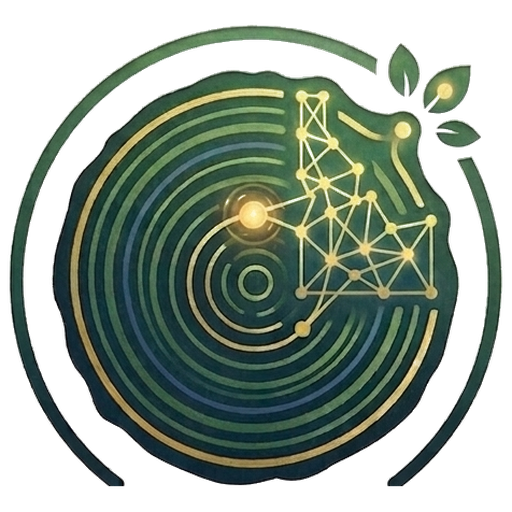

# Cambium Academy

Free, high-level AI courses from [Cambium AI Research Institution](https://www.linkedin.com/company/cambium-ai-institute/). One new course every week.

Each course is built the same way: a short video lecture you can watch on YouTube, a clean slide deck, a page of hand-verified free resources if you want to go deeper, a 20-question quiz, and a certificate when you pass. No signup, no payment, no tracking. Ever.

## How a course works

Every course follows a required learning path; the quiz stays locked until the study steps are done, so the certificate means something.

1. The lecture: watch it on YouTube (and mark it watched) or read the full slide deck
2. Clear all flashcards; ask Aira, the AI teacher, whenever you get stuck
3. Explore every lab in the hands-on AI playground
4. The quiz unlocks: 20 questions, pass at 70%
5. Enter your name and print your certificate
6. Say hello on the course Q&A and discussion boards, and follow the institute on [LinkedIn](https://www.linkedin.com/company/cambium-ai-institute/)

Total time per course: about 60 to 90 minutes.

## Catalog

| # | Course | Status | Start here |
|---|--------|--------|------------|
| 01 | Intro to AI: how models work, how they are trained, and which one to use | Ready | [Course page](course-01-intro-to-ai/web/index.html) · [Syllabus](course-01-intro-to-ai/README.md) |
| 02 | Prompting Essentials: getting great results from any AI | Week 2 | planned |
| 03 | AI for Everyday Productivity: writing, email, documents, spreadsheets | Week 3 | planned |
| 04 | Research with AI: deep research, web search, and citations you can trust | Week 4 | planned |
| 05 | AI for Data: analyze, chart, and explain your numbers | Week 5 | planned |
| 06 | Creating with AI: images, video, and voice | Week 6 | planned |
| 07 | AI Agents: when AI does the work for you | Week 7 | planned |
| 08 | Build Without Code: chatbots and automations | Week 8 | planned |
| 09 | AI and Coding: from idea to working app | Week 9 | planned |
| 10 | Running AI Locally: private, offline, and free | Week 10 | planned |
| 11 | AI Safety and Ethics: limits, risks, and spotting AI mistakes | Week 11 | planned |
| 12 | Capstone: build your personal AI workflow | Week 12 | planned |

Titles for weeks 2 to 12 are a working roadmap and may shift as the audience tells us what they need.

## The Cambium AI Fundamentals specialization

Finish all 12 weekly courses and their quizzes and you have completed the full track. Keep your 12 certificate IDs; when Course 12 ships, a specialization certificate page will accept all twelve and issue the single capstone credential, Cambium AI Fundamentals. Every ID is checkable on each course's verification page.

## Building a new course

Every course follows the production checklist in [_templates/COURSE_TEMPLATE.md](_templates/COURSE_TEMPLATE.md). Research first, verify every fact and link, then build the deck, script, quiz, and certificate. Publishing steps live in each course's PUBLISHING.md.

## License

Course materials are free to share and adapt for non-commercial use with credit to Cambium Institute.
